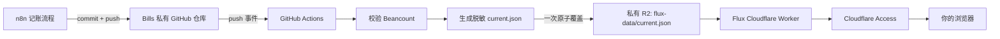

# Flux 的 Cloudflare 与 Git 同步方案

## 最终数据流

这里不让 n8n 轮询 GitHub。n8n 只负责原来的记账与 push；GitHub 收到 push 后原生触发 Action，通常在数秒到数分钟内完成同步。

## 为什么使用单一快照

GitHub Action 先完整校验账本，再生成一个 `current.json`，最后用一次 R2 `put` 覆盖。这样有三个好处：

1. 任一步失败时，R2 继续保留上一份可用快照。
2. 网站不会读到“2025 已更新、2026 还没更新”的混合版本。
3. 快照包含 Git commit SHA，页面/API 可以追溯数据来自哪次 push。

R2 快照使用 `transactions` 级别：包含抽屉所需的商户、交易摘要、金额和分类，但会移除账本文件名、行号以及由它们生成的 ID。R2 桶保持私有，网站入口由 Cloudflare Access 保护。

当前完整快照约 155 KB，其中 2026 年约 153 KB。按当前记账密度线性估算，十年约 1.5 MB，远未达到需要拆分对象的规模；保留单个 `current.json` 可以继续获得一次覆盖即完成更新的原子性。若未来单文件达到数十 MB，再按年份拆分并增加版本清单。

## 已加入 Bills 的自动化

Bills 中的 `.github/workflows/sync-flux-r2.yml` 会在 `main` 分支这些路径变化时运行：

- `main.bean`
- `accounts/**`
- `journal/**`
- `plugins/**`
- 快照导出和校验脚本

任务顺序固定为：安装 Beancount → 校验账本 → 生成脱敏快照 → 上传 R2。`concurrency` 会取消同一分支上尚未完成的旧任务，让最新 push 获胜。

## GitHub Secrets

在 `fireflyshen/Bills` 的 Settings → Secrets and variables → Actions 中添加：

- `CLOUDFLARE_ACCOUNT_ID`
- `R2_ACCESS_KEY_ID`
- `R2_SECRET_ACCESS_KEY`

凭据来自账户级 R2 Token，权限选择“对象读和写”，并且只应用于 `flux-data`。工作流通过 R2 的 S3 兼容 API 上传，因此不需要创建、删除或配置存储桶的管理权限。凭据只放进 GitHub Secrets，不要写进仓库。

## 安全部署顺序

1. 在 Cloudflare 创建私有 R2 桶 `flux-data`，不要开启公共开发 URL或自定义公共域名。
2. 配好上述 GitHub Secrets，手动运行一次 `Sync Flux snapshot to R2`，确认桶里出现 `current.json`。
3. 在 Cloudflare Zero Trust → Access → Applications 中，为 Worker `flux-money` 建立 Access 应用，只允许你的明确邮箱。
4. Access 生效后，在 Flux 中运行 `pnpm deploy`，发布受保护的 `workers.dev` 入口。
5. 显式关闭 Worker Preview URLs，避免产生不需要的额外入口。
6. 用未登录窗口确认会被 Access 拦截，再用你的账号确认页面和 API 正常。

没有完成第 3 步时，不要打开公网入口。这是财务数据应用，不接受“先公开再补权限”的部署顺序。

## 故障行为

- 账本校验失败：不上传，网站继续显示上一快照。
- 连续 push：旧任务取消，最新 commit 重新生成完整快照。
- R2 上传失败：Action 失败，旧对象不受影响。
- R2 尚无快照：Worker API 返回 503，不伪造空账本。
- Worker 可用但 Access 未配置：保持不可路由。
